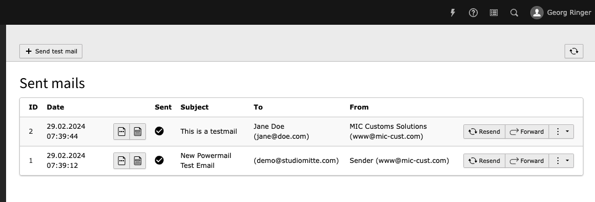

# TYPO3 Extension `sent_mails`

This extension provides a simple way to persist **all** sent mails in the database.
Using a dedicated backend module a user can:

* view the mail including plain & HTML view
* resend the mail
* forward the mail to a different email address
* reject mails with a specific content
* send a test email



## Installation

This extension requires the usage of composer!

```bash
composer req studiomitte/sent-mails
```

## Features

### Reject sending mails

The extension provides a simple way to reject sending mails with a specific content. This can be useful to prevent sending mails to special email addresses.
The current use case is to skip sending mails triggered by frontend tests which use a specific email address like `cypress+1709191116@domain.tld`.

The regex searchwords can be configured in the extension settings with e.g. `cypress\+[\._a-zA-Z0-9-]+@domain\.tld'`.

### Mail-Information API

Calling `/api/mailinformation?search=somecontent` will return a status information about the sent mails. Basic auth needs to be configured in the extension settings.
It only allows to retrieve the information of mails sent in the last 60 seconds

In combination with the feature "Reject sending mails" this can be used to check if a mail would have been sent or not.


### Cleanup Emails

Due to GDPR, emails should not be stored indefinitely. They can be deleted via command or Scheduler Task if they are older than x days. 
By default, only successfully sent emails will be removed.

Usage (delete mails older than 30 days):

```bash
typo3 sentmails:cleanup --days-threshold=30
```

To see all options use:
```bash
typo3 help sentmails:cleanup
```

